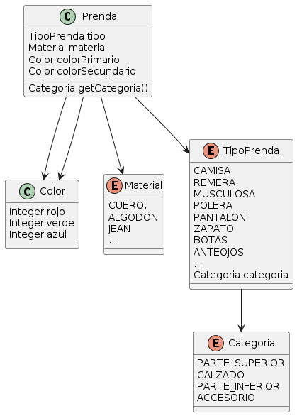

Primera Iteración QueMePongo
===

[Enunciado](https://docs.google.com/document/d/1k1f-9AuIohlBGB2soSNePJ6jLxM37_tZeSD-hW_esIQ/edit)

Primero, las categorias, los tipos de prenda y los materiales fueron modelados con Enum ya que ambas representan formas de clasificación finitas para las prendas.

Además, para que una prenda no tenga una categoria que no se corresponde con el Tipo de prenda, la categoria es un atributo del TipoPrenda.

```java
enum Categoria {
  PARTE_SUPERIOR,
  CALZADO,
  PARTE_INFERIOR,
  ACCESORIO,
}

enum TipoPrenda {
  CAMISA(Categoria.PARTE_SUPERIOR),
  REMERA(Categoria.PARTE_SUPERIOR),
  MUSCULOSA(Categoria.PARTE_SUPERIOR),
  POLERA(Categoria.PARTE_SUPERIOR),
  PANTALON(Categoria.PARTE_INFERIOR),
  ZAPATO(Categoria.CALZADO),
  BOTAS(Categoria.CALZADO),
  ANTEOJOS(Categoria.ACCESORIO),
  
  private Categoria categoria;
  
  public TipoPrenda(Categoria categoria) {
    this.categoria = categoria;
  }
  
  public Categoria getCategoria() {
    return categoria;
  }
}

enum Material {
  CUERO,
  ALGODON,
  JEAN,
}
```

Respecto a los colores, se definió como una clase formada por tres atributos: rojo, verde y azul (red, green and blue o RGB) para poder representar colores con un límite mucho mayor al que se podría con un string.

```java
public class Color {
  private Integer rojo;
  private Integer verde;
  private Integer azul;
  
  public Color(Integer rojo, Integer verde, Integer Azul) {
    this.rojo = rojo;
    this.verde = verde;
    this.azul = azul;
  }
}
```

Finalmente, para modelar las prendas con los atributos que se especificaron obligatorios, se podría hacer de la siguiente manera:

```java
public class Prenda {
  private TipoPrenda tipo;
  private Material material;
  private Color colorPrincipal;
  private Color colorSecundario;
  
  public Prenda(TipoPrenda tipo, Material material, Color colorPrincipal, Color colorPrimario) {
    if(tipo == null || material == null || colorPrincipal == null) {
      throw new AtributoNoDefinidoException();
    }

    this.tipo = tipo;
    this.material = material;
    this.colorPrincipal = colorPrincipal;
    this.colorSecundario = colorSecundario;
  }

  public Categoria getCategoria() {
    return this.tipo.getCategoria();
  }
```

### Diagrama de Clases

