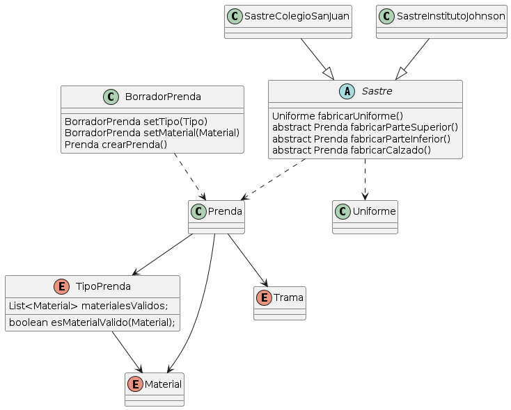

Segunda Iteración QueMePongo
===

[Enunciado](https://docs.google.com/document/d/10j6XB9zIhl5xox2xBEDEFsgPmueHMkyvLSHcLxl_27Y/edit)

> *Como usuarie de QuéMePongo, quiero especificar qué trama tiene la tela de una prenda (lisa, rayada, con lunares, a cuadros o un estampado).*

La trama puede ser modelada como enum, ya que no hay ninguna restricción sobre las tramas y su relación con los otros componentes del dominio
```java
public enum Trama {
  LISA,
  RAYADA,
  A_CUADROS,
  ESTAMPADO
}
```

> *Como usuarie de QuéMePongo, quiero guardar un borrador de la última prenda que empecé a cargar para continuar después.*

Para este requerimiento, podemos cargar una nueva clase que sea BorradorPrenda. Su objetivo va a ser ocuparse de la **creación** de una prenda
```java
public class BorradorPrenda {
  // ...
}
```

> *Como usuarie de QuéMePongo, quiero crear una prenda especificando primero de qué tipo es.*

> *Como usuarie de QuéMePongo, quiero poder no indicar ninguna trama para una tela, y que por defecto ésta sea lisa.*

Respecto a los requerimientos pedidos, podemos solucionar 'cargar primero el tipo de prenda' cargándolo directamente en el constructor para que el TipoPrenda sea obligatorio, y sea lo primero que se carga.

Respecto al requerimiento 'tener por defecto la trama lisa', también podemos setear en el constructor la trama como Lisa para que cada vez que se pida la misma desde un getter, el valor que tenga sea Lisa.
```java
public class BorradorPrenda {
  public BorradorPrenda(TipoPrenda tipoPrenda) {
    this.tipoPrenda = Objects.requireNonNull(tipoPrenda, "El tipo de prenda es obligatorio");
    this.trama = Trama.LISA;
  }
```

> *Como usuarie de QuéMePongo, quiero crear una prenda especificando en segundo lugar los aspectos relacionados a su material (colores, material, trama, etc) para evitar elegir materiales inconsistentes con el tipo de prenda.*

Para esto, podemos crear setters en nuestra clase BorradorPrenda, que vaya cargando cada parte de la prenda en el momento que se necesite.

```java
public class BorradorPrenda {
  // ...anterior
  BorradorPrenda setTipoPrenda(TipoPrenda tipoPrenda) {
    this.tipoPrenda = tipoPrenda;
    return this;
  }

  BorradorPrenda setMaterial(Material material) {
    this.material = material;
    return this;
  }

  BorradorPrenda setTrama(Trama trama) {
    this.trama = trama == null ? Trama.LISA : trama;
    return this;
  }

  BorradorPrenda setColorPrimario(Color color) {
    this.colorPrimario = color;
    return this;
  }
}
```

Para cumplir con la parte de *"para evitar elegir materiales inconsistentes con el tipo de prenda."* podemos crear para el TipoPrenda elegida, un mensaje que nos avise cuando el Material seleccionado no es consistente con el TipoPrenda. Para esto, cada TipoPrenda va a tener un listado de Material y ese chequeo se puede hacer en el setter de material
```java
BorradorPrenda setMaterial(Material material) {
  if (!this.getTipoPrenda().esMaterialValido(material)) {
    throw new MaterialInvalidoException("El material: " + material + "es inconsistente con el tipo de prenda: " + this.getTipoPrenda());
  };
  this.material = material;
  return this;
}

public enum TipoPrenda {
  CAMISA(Categoria.PARTE_SUPERIOR, new List<Material>({Material.LINO, Material.ALGODON })),
  REMERA(Categoria.PARTE_SUPERIOR, new List<Material>({ Material.ALGODON, Material.TELA})),
  // etc.

  public TipoPrenda(Categoria categoria, List<Material> materialesValidos) {
    this.categoria = categoria;
    this.materialesValidos = new ArrayList(materialesValidos);
  }

  public boolean esMaterialValido(Material materialAValidar) {
    return this.getMaterialesValidos().stream().anyMatch((material) -> material.equals(materialAValidar));
  }
}
```

Además podríamos anidar los setters devolviendo *this*.

```java
BorradorPrenda intentoDeZapatilla = new BorradorPrenda(TipoPrenda.Zapato);
intentoDeZapatilla.setMaterial(...).setTrama(...).setColorPrimario(...)
```


> *Como usuarie de QuéMePongo, quiero poder guardar una prenda 
solamente si esta es válida.*

Esto lo podemos solucionar con un método en el BorradorPrenda, que se ocupe de instanciar la prenda cuando sea necesario.
El método `validarPrenda()` va a incluir la validación sobre los objetos obligatorios, alguna consistencia de materiales (que no específica el enunciado), u cualquiera que surja
```java
public class BorradorPrenda {
    //...anterior
    public Prenda crearPrenda() {
        this.validarPrenda();
        return new Prenda(
            this.getTipoPrenda(),
            this.getMaterial(),
            this.getColorPrincipal(),
            this.getColorSecundario());
    }
}
```


### Bonus track

> *Como usuario QueMePongo, quiero que un uniforme siempre conste de una prenda superior, una inferior y un calzado*

Podemos modelar una clase Uniforme con su constructor y las validaciones necesarias para la misma
```java
public class Uniforme {
  Prenda parteSuperior;
  Prenda parteInferior;
  Prenda calzado;

  public Uniforme(Prenda parteSuperior, Prenda parteInferior, Prenda calzado) {
    this.parteSuperior = Objects.requireNonNull(parteSuperior, "La parte superior de un uniforme es obligatoria");
    this.parteInferior = Objects.requireNonNull(parteInferior, "La parte inferior de un uniforme es obligatoria");
    this.calzado = Objects.requireNonNull(calzado, "El calzado de un uniforme es obligatorio");
  }
}
```

> *Como usuario QueMePongo, quiero poder recibir sugerencias de uniformes armados.*

>*Como administrador de QueMePongo, quiero poder configurar diferentes uniformes para distintas instituciones (Ej: para el colegio San Juan debe ser una chomba verde de piqué, un pantalón de acetato gris y zapatillas blancas, mientras que para el Instituto Johnson siempre será una camisa blanca, pantalón de vestir negro y zapatos negros)*

Para este requerimiento, podemos usar una clase abstracta Sastre, que tenga definido solo el comportamiento de la creación del Uniforme. Las definiciones de los métodos abstractos, serán realizadas por las clases que hereden de la clase usando `@Override`
```java
abstract class Sastre {
	public Uniforme fabricarUniforme() {
		return new Uniforme(this.fabricarParteSuperior(), this.fabricarParteInferior() , this.fabricarCalzado());
	}	
	abstract Prenda fabricarParteSuperior();
	abstract Prenda fabricarParteInferior();
	abstract Prenda fabricarCalzado();
}

public class SastreColegioSanJuan extends Sastre {
  @Override
  Prenda fabricarParteSuperior() {
    Borrador borrador = new Borrador(TipoPrenda.CHOMBA);
    borrador.setColorPrimario(Color.VERDE).setMaterial(Material.PIQUE);
    return borrador.crearPrenda();
  }

  @Override
  Prenda fabricarParteInferior() {
    Borrador borrador = new Borrador(TipoPrenda.PANTALON);
    borrador.setColorPrimario(Color.GRIS).setMaterial(Material.ACETATO);
    return borrador.crearPrenda();
  }

  @Override
  Prenda fabricarCalzado() {
    Borrador borrador = new Borrador(TipoPrenda.ZAPATILLA);
    borrador.setColorPrimario(Color.BLANCO).setMaterial(Material.TELA);
    return borrador.crearPrenda();
  }
}

public class SastreInstitutoJohnson {
    @Override
  Prenda fabricarParteSuperior() {
    Borrador borrador = new Borrador(TipoPrenda.CAMISA);
    borrador.setColorPrimario(Color.BLANCO).setMaterial(Material.ALGODON);
    return borrador.crearPrenda();
  }

  @Override
  Prenda fabricarParteInferior() {
    Borrador borrador = new Borrador(TipoPrenda.PANTALON);
    borrador.setColorPrimario(Color.NEGRO).setMaterial(Material.DE_VESTIR);
    return borrador.crearPrenda();
  }

  @Override
  Prenda fabricarCalzado() {
    Borrador borrador = new Borrador(TipoPrenda.ZAPATO);
    borrador.setColorPrimario(Color.NEGRO).setMaterial(Material.CUERO);
    return borrador.crearPrenda();
  }
}
```

### Diagrama de Clases

