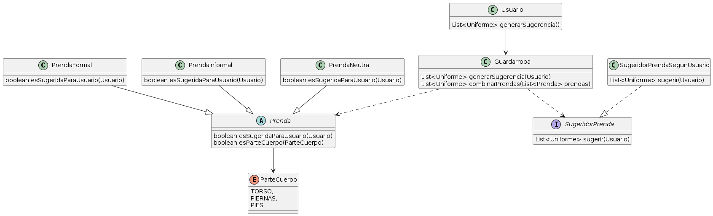

Tercera Iteración QueMePongo
===

[Enunciado](https://docs.google.com/document/d/1XGb_Xt2v3viZY4RNky6zguL-ATv1iqEzHWhK4a6vsIk/edit#heading=h.uyku9mnteh0t)

___

> *Como usuarie de QuéMePongo, quiero recibir una sugerencia de prendas que me vista completamente (torso, piernas, pies), cubriendo cada parte del cuerpo con no más de una prenda (es decir, evitando superposiciones por ahora).*

> *Como usuarie de QuéMePongo, quiero recibir varias sugerencias que combinen todas las prendas de mi guardarropas*

> *Como administradore de QuéMePongo, quiero que, si así esta configurado, al generarse las sugerencias, no se ejecute ningún tipo de lógica adicional.*

> *Como administradore de QuéMePongo, quiero poder cambiar el motor de sugerencias periódicamente entre los existentes (o nuevos) para evaluar cuál genera un mejor efecto sobre los usuarios.*

Esto lo hice con el método del Guardarropa `generarSugerencia(Usuario)`, que adentro se ocupa de:
- Delegarle a un SugeridorPrenda la sugerencia según todas las prendas, es decir: filtrar las prendas según algúna lógica que indique el sugeridor concreto. La razón por la que delegué la generacion de sugerencias de prendas a un Sugeridor, es porque se puede cambiar la implementación concreta del sugeridor, pero siempre tiene que tener el mismo comportamiento. Esto se puede lograr haciendo injección de dependencias. En este caso la clase concreta es `SugeridorPrendasSegunUsuario` y cada clase concreta de la (ahora) clase abstracta Prenda va a tener el método `esSugeridaParaUsuario` que va a determinar la respuesta para este sugeridor.

- Una vez que tenemos todas las prendas filtradas, `combinarPrendas(List<Prenda> prendas)` para poder tener un Uniforme, que es lo mismo que 'Sugerencia', una clase que tiene una `ParteCuerpo.TORSO`, una `ParteCuerpo.PIERNA` y una `ParteCuerpo.PIE` (atributo nuevo de Prenda de tipo enum). La razón por la que delegué este comportamiento al Guardarropa es porque el enunciado específica que esa combinación de prendas no va a cambiar.

___


> *Como usuarie de QuéMePongo, quiero poder indicar si una prenda es formal, informal, o neutra.*

> *Como administradore de QuéMePongo, quiero que, si así está configurado,  al generarse las sugerencias, se filtre la ropa informal para les usuaries mayores de 55 años.*

Esto lo hice pasando la clase Prenda abstracta y generando clases concretas 'PrendaFormal', 'PrendaInformal', y 'PrendaNeutra'. Todas tienen en común la implementación del nuevo método abstracto de Prenda `boolean esSugeridaParaUsuario(Usuario usuario);` donde dependen de factores para saber si son o no sugeridas las prendas para ese usuario. Por ejemplo, una PrendaFormal no va a serSugeridaParaUsuario cuya edad sea > 55.
___

```java
public class Usuario {
    private Guardarropas guardarropas;

    List<Uniforme> generarSugerencia() {
        return this.guardarropas.generarSugerencias(this);
    };

    getEdad() {
        return this.edad;
    }

    getPrendas() {
        return this.getGuardarropas().getPrendas();
    }
}

public class Guardarropas {
    private List<Prenda> prendas;
    private SugeridorPrendas sugeridor;

    public Guardarropas(SugeridorPrendas Sugeridor) {
        this.sugeridor = sugeridor;
    }

    List<Uniforme> generarSugerencia(Usuario usuario) {
        List<Prenda> prendas = this.sugeridor.sugerir(usuario);

        List<Uniforme> sugerencias = this.combinarPrendas(prendas);

        return sugerencias;
    }

    List<Uniforme> combinarPrendas(List<Prenda> prendas) {
        List<Uniforme> = new ArrayList();

        while (prendas.size() > 0) {
            Prenda torso = this.getTorso(prendas);
            Prenda piernas = this.getPiernas(prendas);
            Prenda pies = this.getPies(prendas);
            prendas.remove(Arrays.asList(torso, piernas, pies));

            Uniforme sugerencia = new Uniforme(torso, piernas, pies);
            sugerencias.push(sugerencia);
        }
    }

    private Prenda getTorso(List<Prenda> prendas) {
        return this.getPrendasPorParteCuerpo(
            prendas,
            ParteCuerpo.TORSO
        );
    }

    private Prenda getPiernas(List<Prenda> prendas) {
        return this.getPrendasPorParteCuerpo(
            prendas,
            ParteCuerpo.PIERNAS
        );
    }

    private Prenda getPies(List<Prenda> prendas) {
        return this.getPrendasPorParteCuerpo(
            prendas,
            ParteCuerpo.PIES
        );
    }

    private Prenda getPrendasPorParteCuerpo(
        List<Prenda> prendas,
        ParteCuerpo parte) {
        return prendas
            .filter((prenda) -> prenda.esParteCuerpo(parte))
            .first();
    }
}

interface SugeridorPrendas {
    List<Prenda> sugerir(Usuario usuario);
}

class SugeridorPrendasSegunUsuario implements SugeridorPrendas {
    public List<Prenda> sugerir(Usuario usuario) {
        List<Prenda> prendasSugeridas = usuario.getPrendas()
            .stream()
            .filter((prenda) -> prenda.esSugeridaParaUsuario(usuario));

        return prendasSugeridas;
    }
}

abstract public class Prenda {
    abstract boolean esSugeridaParaUsuario(Usuario usuario);
    ParteCuerpo parteCuerpo;
    //...
}

public class PrendaFormal extends Prenda {
    @Override
    public boolean esSugeridaParaUsuario(Usuario usuario) {
        return true;
    }

}

public class PrendaInformal extends Prenda {
    @Override
    public boolean esSugeridaParaUsuario(Usuario usuario) {
        return usuario.getEdad() < 55;
    }
}

public class PrendaNeutra extends Prenda {
    @Override
    public boolean esSugeridaParaUsuario(Usuario usuario) {
        return true;
    }
}
```

### Diagrama de Clases

