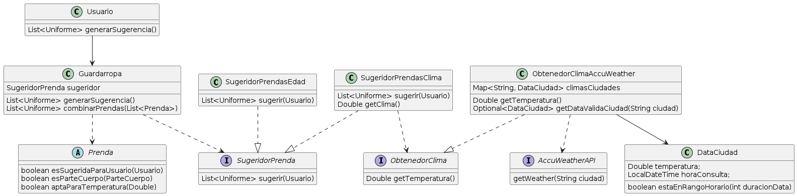

Cuarta Iteración QueMePongo
===

[Enunciado](https://docs.google.com/document/d/1sy9S9EeIQr8fhatKnfTCgOfjVniJDu2viI-Av0gn0xY/edit#heading=h.uyku9mnteh0t)

___

### Requerimientos
> *Como usuarie de QuéMePongo, quiero poder conocer las condiciones climáticas de Buenos Aires en un momento dado para obtener sugerencias acordes.*

> *Como administradore de QuéMePongo, quiero poder configurar fácilmente diferentes servicios de obtención del clima para ajustarme a las cambiantes condiciones económicas.*

Para poder adaptar la solución a la iteración anterior, podemos crear una clase concreta que sea 'SugeridorPrendasClimaticas', que va a tener un ObtenedorClima. Para poder configurarlo facilmente, lo podemos setear usando inyección de dependencias.
ObtenedorClimaAccuWeather, va a ser la primera implementación de esa interfaz. Va a conocer a AccuWeatherAPI, y la va a usar internamente, pero lo que nos importa es que cumpla con el contrato de ObtenedorClima.


La implementación sería:
```java
ObtenedorClima obtenedor = new ObtenedorClimaAccuWeather();
SugeridorPrendas sugeridor = new SugeridorPrendasClimaticas(obtenedor);
sugeridor.sugerir(usuario);

//... si queremos podemos usar otra implementación del obtenedorDeClima, para el mismo SugeridorDePrendaClimatica, cumpliendo la 'configuración fácil de servicio de obtención de clima'
```
```java

interface SugeridorPrendas {
    List<Prenda> sugerir(Usuario usuario);
}

public class SugeridorPrendasClimaticas implements SugeridorPrendas {
    ObtenedorClima obtenedorClima;

    SugeridorPrendasClimaticas(ObtenedorClima obtenedorClima) {
        this.obtenedorClima = obtenedorClima;
    }

    public List<Prenda> sugerir(Usuario usuario) {
        List<Prenda> prendasSugeridas = usuario.getPrendas()
            .stream()
            .filter((prenda) -> prenda.esAptaParaTemperatura(this.getTemperatura()));

        return prendasSugeridas;
    }

    public Double getTemperatura() {
        return this.getObtenedorClima().getTemperatura();
    }
}

interface ObtenedorClima {
    Double getTemperatura(String ciudad);
}

interface AccuWeatherAPI {
    List<Map<String, Object>> getWeather(String city);
}

public class ObtenedorClimaAccuWeather implements ObtenedorClima {
    private AccuWeatherAPI accuWeather;

    ObtenedorClimaAccuWeather() {
        this.accuWeather = new AccuWeather();
    }

    Double getTemperatura(String ciudad) {
        return this.accuWeather.getWeather(ciudad)
    }
}

```
> *Como usuarie de QuéMePongo, quiero que al generar una sugerencia las prendas sean acordes a la temperatura actual sabiendo que para cada tipo de prenda habrá una temperatura hasta la cual es adecuada. (Ej.: “Remera de mangas largas” no es apta a más de 20°C)*

Para poder cumplir con el requerimiento, el SugeridorPrendaClimatica va a delegarle la responsabilidad a la clase Prenda si es apto para cierta temperatura, y la misma va a delegarle al TipoPrenda ese mensaje.
Todos los que sean aptos para la temperatura, van a ser filtrados por el sugeridor.

```java
public abstract class Prenda {
    boolean aptaParaTemperatura(Double temperatura) {
        return this.getTipoPrenda().aptoParaTemperatura(temperatura);
    }
}

public enum TipoPrenda {
    //...
    Double temperaturaLimite

    public TipoPrenda(Double temperaturaLimite) {
        this.temperaturaLimite = temperaturaLimite;
    }

    boolean aptoParatemperatura(Double temperatura) {
        return this.getTemperaturaLimite() > temperatura;
    }
}
```


> *Como stakeholder de QuéMePongo, quiero poder asegurar la calidad de mi aplicación sin incurrir en costos innecesarios.*

Para este requerimiento, vamos a tener que agregar más comportamiento en ObtenedorClimaAccuWeather, que según el enunciado

> *(...) AccuWeather provee un SDK para Java que nos entrega una lista con el clima de las próximas 12 horas (...)*
>
> *(...) Y nos cobra 0,05 USD por cada vez que la llamamos a partir del décimo llamado diario.*

Entonces, podemos inferir que guardando cada 12 horas la información de una misma ciudad, estamos resolviendo el menor gasto con la información lo más cercana a la realidad posible.

Esto lo podemos lograr generando un mapeo donde guardemos para cada ciudad consultada, la información 'DataClimaCiudad' que hayamos recibido de AccuWeather
La consulta sobre esta caché, y determinación si usarla o si llamar a la API va a ser responsabilidad del ObtenedorClimaAccuWeather.
Después, a DataClimaCiudad, le asignamos el comportamiento de saber dada una cantidad de horas si estaEnRangoHorario(). Esto nos permite cambiar ese rangoHorario a demanda sin romper la implementación
```java
public class ObtenedorClimaAccuWeather implements ObtenedorClima {
    private AccuWeatherAPI accuWeather;
    Map<String, DataCiudad> climasCiudades = new HashMap<String, DataCiudad>();

    private static int DURACION_DATA_HORAS = 12;

    ObtenedorClimaAccuWeather() {
        this.accuWeather = new AccuWeather();
    }

    Double getTemperatura(String ciudad) {
        Optional<DataCiudad> dataCiudad = this.getDataValidaCiudad(ciudad);
        if (dataCiudad.isPresent()) {
            return dataCiudad.getTemperatura();
        }

        Double temperatura = this.accuWeather.getWeather(ciudad);
        DataCiudad data = new DataCiudad(temperatura, LocaldateTime.now());
        this.climasCiudades.put(ciudad, data);
        return temperatura;
    }

    Optional<DataCiudad> getDataValidaCiudad(String ciudad) {
        Optional<DataCiudad> data = Optional.ofNullable(this.climasCiudades.get(ciudad));

        if (!data.isPresent()) {
            return data;
        }

        if (data.estaEnRangoHorario(DURACION_DATA_HORAS)) {
            return data;
        }

        return Optional.empty();
    }
}

public class DataClimaCiudad {
    private Double temperatura;
    private LocalDateTime horaConsulta;

    public DataCiudad(Double temperatura, LocalDateTime horaConsulta) {
        this.temperatura = temperatura;
        this.horaConsulta = horaConsulta;
    }

    boolean estaEnRangoHorario(int duracionData) {
        LocalDateTime horaPreviaLimite = LocalDateTime.now().minus(duracionData, ChronoUnit.HOURS);

        return horaPreviaLimite.isAfter(this.getHoraConsulta());
    }

}
```

### AccuWeatherAPI
```java
import java.util.*;

public final class AccuWeatherAPI {

    public final List<Map<String, Object>> getWeather(String ciudad) {
		return Arrays.asList(new HashMap<String, Object>(){{
			put("DateTime", "2019-05-03T01:00:00-03:00");
			put("EpochDateTime", 1556856000);
			put("WeatherIcon", 33);
			put("IconPhrase", "Clear");
			put("IsDaylight", false);
			put("PrecipitationProbability", 0);
			put("MobileLink", "http://m.accuweather.com/en/ar/villa-vil/7984/");
			put("Link", "http://www.accuweather.com/en/ar/villa-vil/7984");
			put("Temperature", new HashMap<String, Object>(){{
				put("Value", 57);
				put("Unit", "F");
				put("UnitType", 18);
			}});
		}});
	}
}
```

### Diagrama de Clases

