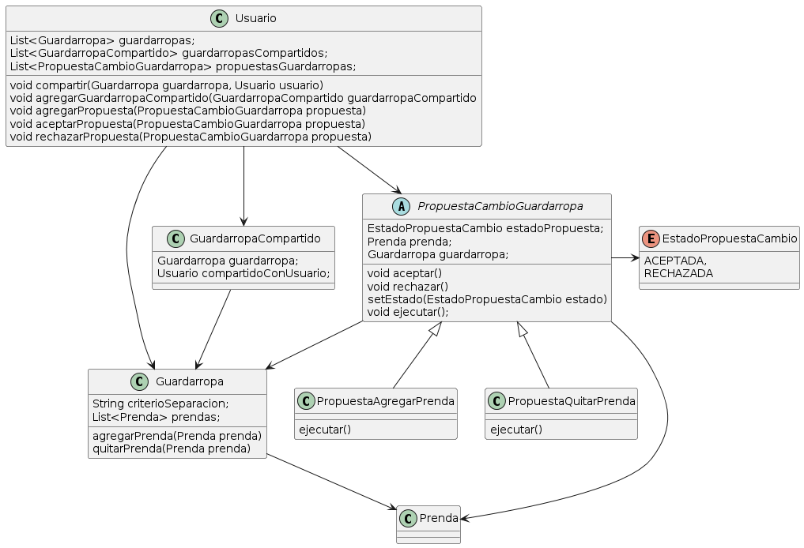

Quinta Iteración QueMePongo
===

[Enunciado](https://docs.google.com/document/d/1wS622pMwZrDK9ilL_hEt5bBE04vKUKZILx8cIQ-aQzU/edit)

___


> *Como usuarie de QuéMePongo, quiero poder manejar varios guardarropas para separar mis prendas según diversos criterios (ropa de viaje, ropa de entrecasa, etc).*

Para cumplir este requerimiento, el usuario tiene una lista de guardarropas en vez de 1 solo. Además, el guardarropas va a tener un `String criterioSeparacion` para dejarle al usuario determinar cual es la razón de ser de ese guardarropas


> *Como usuarie de QuéMePongo, quiero poder crear guardarropas compartidos con otros usuaries (ej, ropa que comparto con mi hermane).*

Para cumplir este requerimiento, le agrego a la firma de Usuario el mensaje `compartir(Guardarropa, Usuario)` y la lista de guardarropasCompartidos para poder agregar o quitar sus guardarropas compartidos. La razón de tenerlo en el Usuario es que solamente el propio usuario va a poder compartir un guardarropa propio.

> *Como usuarie de QuéMePongo, quiero que otro usuario me proponga tentativamente agregar una prenda al guardarropas.*

> *Como usuarie de QuéMePongo, necesito ver todas las propuestas de modificación (agregar o quitar prendas) del guardarropas y poder aceptarlas o rechazarlas.*

> *Como usuarie de QuéMePongo, quiero poder deshacer las propuestas de modificación que haya aceptado.*

Para este requerimiento, creé la clase PropuestaCambioGuardarropa.
Se crea una propuesta haciendo lo siguiente:
```java
PropuestaCambioGuardarropa propuesta = new PropuestaQuitarPrenda(prenda, guardarropa);
usuarioAProponer.agregarPropuesta(propuesta);
```
El usuario puede ver las propuestas teniendo acceso a su lista de propuestas.
El usuario puede `aceptarPropuesta(Propuesta)` o `rechazarPropuesta(Propuesta)` solo cuando una propuesta está en su lista de Propuestas.

Además, para guardar el estado de la propuesta, se agrega un enum con ACEPTADA, RECHAZADA que indica como quedó la propuesta de cambio.
Tiene la Prenda a agregar o quitar, tiene el guardarropa al que se propone agregar o quitar esa prenda y el Usuario que creó la proposición.

Para modelar `PropuestaCambioGuardarropa` se hizo una clase abstracta que implementa `aceptar()` y `rechazar()`. El caso de aceptar setea el estado ACEPTADA, mientras que rechazar, setea el estado RECHAZADA.
Las clases concretas van a ser `PropuestaAgregadoPrenda` y `PropuestaQuitarPrenda`, y ambas se pueden `aceptar()` y `rechazar()`.
La diferencia es qué pasa cuando se acepta la propuesta. Por eso, la clase abstracta no implementa pero define `void ejecutar()`, que se va a ejecutar al llamar al mensje `aceptar()`.
`PropuestaAgregadoPrenda` al `ejecutar()` va a hacer `this.guardarropa.agregarPrenda(this.prenda)`.
`PropuestaQuitarPrenda` al `ejecutar()` va a hacer `this.guardarropa.quitarPrenda(this.prenda)`


```java
public class Usuario {
    List<Guardarropa> guardarropas;
    List<GuardarropaCompartido> guardarropasCompartidos;
    List<PropuestaCambioGuardarropa> propuestasGuardarropas;
    
    void compartir(Guardarropa guardarropa, Usuario usuario) {
        Guardarropa guardarroapa = this.guardarropas.find(guardarropa);
        if (guardarropa == null) {
            throw new GuardarropaNoPropioException();
        }

        GuardarropaCompartido guardarropaCompartido = new GuardarropaCompartido(guardarropa, usuario);
        this.agregarGuardarropaCompartido(guardarropaCompartido);
    }

    void agregarGuardarropaCompartido(GuardarropaCompartido guardarropaCompartido) {
        this.guardarropasCompartidos.add(guardarropaCompartido);
    }

    void agregarPropuesta(PropuestaCambioGuardarropa propuesta) {
        this.verificarGuardarropasPropio(propuesta);
        this.propuestasPrendas.add(propuesta);
    }

    void aceptarPropuesta(PropuestaCambioGuardarropa propuesta) {
        this.verificarPropuestaPropia(propuesta);
        propuesta.aceptar()
    }

    void rechazarPropuesta(PropuestaCambioGuardarropa propuesta) {
        this.verificarPropuestaPropia(propuesta);
        propuesta.rechazar();
    }

    private verificarGuardarropasPropio(propuesta) {
        Guardarropa guardarropa = this.guardarropas.find(propuesta.getGuardarropa());

        if (guardarropa == null) {
            throw new GuardarropaAjenoException();
        }
    }

    private verificarPropuestaPropia(PropuestaCambioGuardarropa propuesta) {
        PropuestaCambioGuardarropa propuesta = this.propuestasPrendas.find(propuesta);

        if (propuesta == null) {
            throw new PropuestaAjenaException();
        }
    }
}

public class Guardarropa {
    String criterioSeparacion;
    List<Prenda> prendas;

    agregarPrenda(Prenda prenda) {
        this.prendas.add(prenda);
    }

    quitarPrenda(Prenda prenda) {
        this.prendas.remove(prenda);
    }
}

public class GuardarropaCompartido {
    Guardarropa guardarropa;
    Usuario compartidoConUsuario;
}

public abstract class PropuestaCambioGuardarropa {
  EstadoPropuestaCambio estadoPropuesta;
  Prenda prenda;
  Guardarropa guardarropa;

  void aceptar() {
    this.setEstado(EstadoPropuestaCambio.ACEPTADA);
    this.ejecutar();
  }

  void rechazar() {
    this.setEstado(EstadoPropuestaCambio.RECHAZADA);
  }

  setEstado(EstadoPropuestaCambio estado) {
    this.estadoPropuesta = estado;
  }

  void ejecutar();
}

enum EstadoPropuestaCambio {
    ACEPTADA,
    RECHAZADA
}

public class PropuestaAgregarPrenda extends PropuestaCambioGuardarropa {
  ejecutar() {
    this.guardarropa.agregarPrenda(this.prenda);
  }
}

public class PropuestaQuitarPrenda extends PropuestaCambioGuardarropa {
  ejecutar() {
    this.guardarropa.quitarPrenda(this.prenda);
  }
}
```


### Diagrama de Clases

